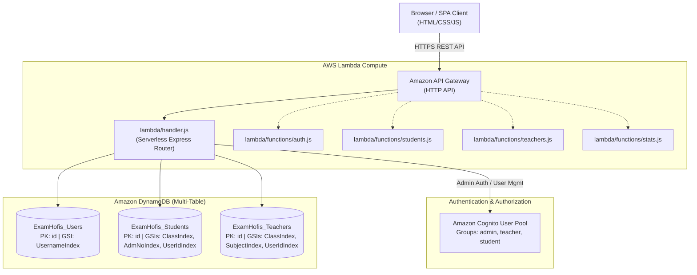

# ExamHofis: AWS Cognito, Lambda & DynamoDB Architecture Guide

This project features a complete **AWS Serverless Architecture** using **Amazon Cognito**, **AWS Lambda**, and **Amazon DynamoDB** with a multi-table design.

---

## 🏛️ Architecture Overview



---

## 📁 Project Structure & AWS Files

| Path | Purpose |
|---|---|
| [`config/aws-config.js`](file:///d:/ExamHofis/config/aws-config.js) | Initializes AWS SDK v3 clients (`DynamoDBClient`, `DynamoDBDocumentClient`, `CognitoIdentityProviderClient`). |
| [`services/cognitoService.js`](file:///d:/ExamHofis/services/cognitoService.js) | Manages Cognito user creation, group assignments (`admin`/`teacher`/`student`), password configuration, login, and JWT verification. |
| [`services/dynamoService.js`](file:///d:/ExamHofis/services/dynamoService.js) | DynamoDB DocumentClient operations: CRUD, GSI queries (`ClassIndex`, `AdmissionNoIndex`, `SubjectIndex`, `UserIdIndex`), and stats calculation. |
| [`lambda/handler.js`](file:///d:/ExamHofis/lambda/handler.js) | Main AWS Lambda entrypoint powered by `@vendia/serverless-express` for API Gateway HTTP/REST API. |
| [`lambda/functions/`](file:///d:/ExamHofis/lambda/functions/) | Modular microservice Lambda handlers (`auth.js`, `students.js`, `teachers.js`, `stats.js`). |
| [`scripts/setup-aws.js`](file:///d:/ExamHofis/scripts/setup-aws.js) | Automated CLI tool that provisions DynamoDB tables, GSIs, and Cognito User Pool & App Client in AWS. |
| [`scripts/seed-aws.js`](file:///d:/ExamHofis/scripts/seed-aws.js) | Seeds default admin, teachers, and students into AWS Cognito and DynamoDB. |
| [`scripts/test-aws.js`](file:///d:/ExamHofis/scripts/test-aws.js) | End-to-end verification script testing Cognito login, token validation, DynamoDB CRUD, and GSI queries. |
| [`template.yaml`](file:///d:/ExamHofis/template.yaml) | AWS SAM (CloudFormation) template for 1-click cloud deployment. |
| [`serverless.yml`](file:///d:/ExamHofis/serverless.yml) | Serverless Framework configuration. |
| [`.env.example`](file:///d:/ExamHofis/.env.example) | Template for AWS region, credentials, and DynamoDB/Cognito IDs. |

---

## 🗄️ DynamoDB Multi-Table Schema

### 1. `ExamHofis_Users`
- **Partition Key (PK)**: `id` (String - Cognito Sub / UUID)
- **Global Secondary Index (GSI)**:
  - `UsernameIndex`: Partition Key `username` (String)
- **Attributes**: `id`, `username`, `role` (`admin` | `teacher` | `student`), `name`, `email`, `plain_password`, `created_at`

### 2. `ExamHofis_Students`
- **Partition Key (PK)**: `id` (String - UUID)
- **Global Secondary Indexes (GSIs)**:
  - `ClassIndex`: Partition Key `class` (Number)
  - `AdmissionNoIndex`: Partition Key `admission_no` (String)
  - `UserIdIndex`: Partition Key `user_id` (String)
- **Attributes**: `id`, `user_id`, `name`, `class` (1–10), `div` (A–E), `admission_no`, `photo_url`, `username`, `plain_password`, `created_at`

### 3. `ExamHofis_Teachers`
- **Partition Key (PK)**: `id` (String - UUID)
- **Global Secondary Indexes (GSIs)**:
  - `ClassIndex`: Partition Key `class` (Number)
  - `SubjectIndex`: Partition Key `subject` (String)
  - `UserIdIndex`: Partition Key `user_id` (String)
- **Attributes**: `id`, `user_id`, `name`, `class` (1–10), `subject` (English, Malayalam, Chemistry, Physics, Biology, Science, Maths), `username`, `plain_password`, `created_at`

---

## 🚀 Quickstart: Provisioning & Connecting to AWS

### Step 1: Set AWS Credentials
Configure your AWS credentials either via AWS CLI:
```bash
aws configure
```
Or by creating a `.env` file from `.env.example`:
```ini
USE_AWS=true
AWS_REGION=ap-south-1
AWS_ACCESS_KEY_ID=YOUR_AWS_ACCESS_KEY_ID
AWS_SECRET_ACCESS_KEY=YOUR_AWS_SECRET_ACCESS_KEY
```

### Step 2: Provision AWS Resources
Run the automated setup script to create your Cognito User Pool, Client, Groups, and DynamoDB tables with all GSIs:
```bash
npm run aws:setup
```
This script will automatically create the tables, user pool, app client, and save the IDs directly into your `.env` file!

### Step 3: Seed Sample Accounts & Data
Populate default administrator, faculty members, and students into AWS Cognito & DynamoDB:
```bash
npm run aws:seed
```

Default credentials seeded:
- **Admin**: `admin` / `admin123`
- **Teacher**: `ananya.physics` / `teacher123`
- **Student**: `aarav10a` / `student123`

### Step 4: Verify AWS Operations
Execute the test suite to verify end-to-end operation across AWS Cognito and DynamoDB:
```bash
npm run aws:test
```

### Step 5: Run App Locally in AWS Mode
Start your local server connected directly to AWS:
```bash
npm run dev
```
Visit `http://localhost:3000` to test your application backed by AWS Cognito and DynamoDB!

---

## ☁️ Deploying to AWS Cloud (Serverless)

### Option A: AWS SAM (Recommended)
Build and deploy the application to AWS Lambda and API Gateway:
```bash
# 1. Build SAM package
npm run lambda:build

# 2. Deploy to AWS
npm run lambda:deploy
```

### Option B: Serverless Framework
```bash
npm run serverless:deploy
```

After deployment, AWS CloudFormation will output your live API Gateway URL:
```
https://xxxxxx.execute-api.ap-south-1.amazonaws.com
```
